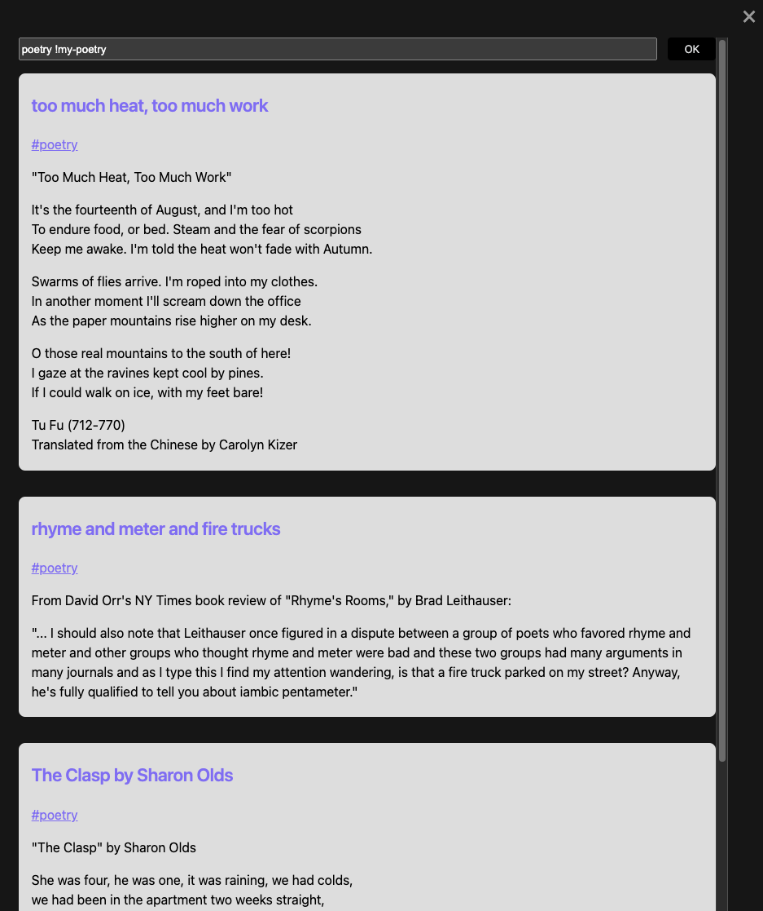
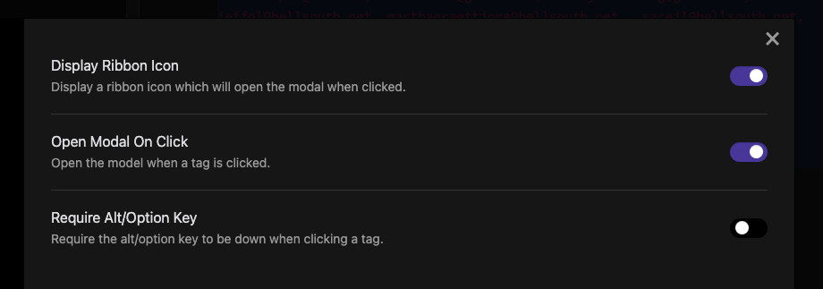

# Obsidian Tagged Document Viewer Plugin

## About

This plugin allows you to view all documents with a given tag or set of tags in a single, scrollable modal. I can imagine various uses of this plugin, but I created it for a specific workflow, in which I journal each work day, using tags to link subjects that repeat. I may then find that I want to scroll through everything I've ever written about CSS (for instance) without having to click each document individually. 

## Usage

There are two ways to use the plugin:

1. By clicking a tag. This will open the modal, showing the contents of all documents that contain the tag. Above the content, at the top of the modal, you'll see a text-input field where you can modify what documents show by adding more tags.

2. By clicking the hashtag icon on the ribbon, which will bring up the just the text-input. You can type any tag or tags into it and then press ENTER or click the OK button to reveal matching documents.

When entering a list of tags, use spaces to separate them, e.g. `home cooking food`. Don't include the hashtag symbol. 

To exclude some documents from displaying, you can prepend a tag with an exclamation point. For instance, typing `programming code !javascript` will display all documents that contain the tags `#programming` or `#code` *except* for ones that also contain `#javacript`. 

Clicking the title of any document will close the modal and take you to that document.

## Settings

There are three togglable settings:

- **Display Ribbon Icon** (on by default). Setting this to off will remove the hashtag icon from the ribbon.

- **Open Modal On Click** (on by default). Setting this to off will disable the modal from opening when you click on tags.

- **Require Alt/Option Key** (off by default). Setting this to on will make the modal only open when you click a tag while holding down the ALT or OPTION key. 

## Possible Future Development

- more complicated queries, e.g. allowing for searches like `(home AND cooking) !pasta` and maybe also allowing for date ranges, so users can search for all documents written prior to 2021 with the tag `taxes`.
- sorting options
- saving scrollable content as a new document
- displaying document-creation dates
- ability to edit documents in the modal
- ability to save then modal state when it's closed
- ability to save queries
- allow tags to be entered in the text-input with or without hash symbols
- allow wildcards, e.g. `work-*` will display documents containing `#work-project-ongoing` or `#work-project-completed`.
